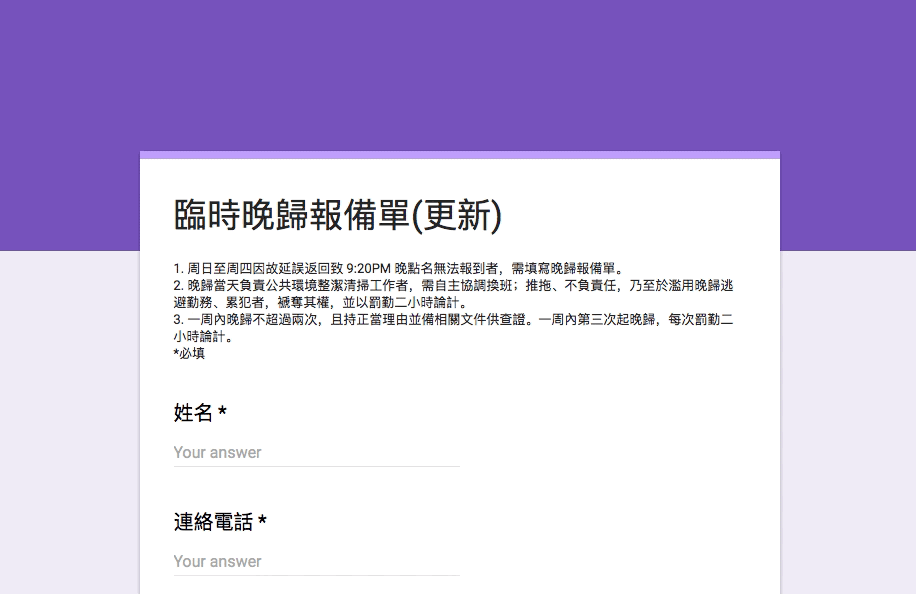

## 兩秒填晚歸

#### 目前使用狀況：`正常`

__一秒打開晚歸單，一秒填完。讚！__

填了半年多的晚歸單，直到剛剛，「幹...為什麼每次都填一樣的單子，打一樣字....」

於是乎，就有一個瀏覽器書籤，可以自動幫你填完個人資料，送出表單。不過你還是得先打開晚歸單的網頁啦QQ。

### 晚歸偷吃步一定有風險，使用前應做好心理準備。

請把第二行第三行後面的 `我的名字/電話是` 換成你的名字/電話

~~~javascript
javascript:(function(){
document.getElementsByName('entry.954463140')[0].value = '我的名字是';
document.getElementsByName('entry.709241587')[0].value = '我的電話是';
document.getElementsByName('entry.1858865286')[0].value = '因私人緊急事項 (看病、就醫、因要事而返家)致延誤返回';
document.getElementsByName('entry.1858865286')[0].disabled = false;
document.getElementsByName('entry.1200038893')[0].value = '21:30';
document.getElementsByName('entry.560005917')[0].value = '本人於此聲明所言屬實，並備相關文件供日後查證';
document.getElementsByName('entry.560005917')[0].disabled = false;
alert(`晚歸填寫成功！\n\n${document.getElementsByName('entry.954463140')[0].value} / ${document.getElementsByName('entry.709241587')[0].value}`);
document.getElementsByTagName('form')[0].submit();
}());
~~~

在常用的瀏覽器裡，找到「書籤管理員」，選擇「新增書籤」。  
名字就隨便吧，在網址的地方就貼上這一整串 blablabla 就完成了。

以後要請晚歸時，只要一如往常地打開[晚歸單](https://docs.google.com/forms/d/1D562AG6R6rg6mlX7QKwOOnPuLcwoxd8_1AMDbuzbFng/viewform)，再點一下剛剛新增的書籤，就搞定囉！

點擊書籤後，預期的結果應該是

> 跳出視窗說「晚歸填寫成功！」，然後是你的名字及電話。  
> 最後跳頁到 google 的送出畫面

如果哪邊少了什麼，最好還是自己重新填寫過喔ㄏㄏ  
如果一直失敗還是管幹那邊沒收到，~~那一定是 Google 的問題啦！~~

----

### 備註

還 __不保證__ 所有手機上的瀏覽器都能正常運作喔！！！
不過在電腦上的瀏覽器應該是沒有問題。